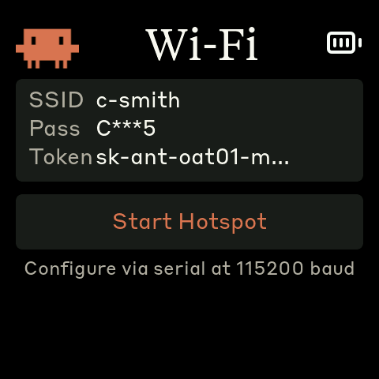

# Clawdmeter — Wi-Fi native fork

> **Fork of [HermannBjorgvin/Clawdmeter](https://github.com/HermannBjorgvin/Clawdmeter).**
> This version removes the host daemon and BLE data channel entirely. The ESP32 polls
> the Anthropic API directly over Wi-Fi — no host PC required once provisioned.
> See [`WIFI_FORK.md`](WIFI_FORK.md) for the full technical delta.

A small ESP32 dashboard for your desk that tracks Claude Code usage in real time.
It runs on a [Waveshare ESP32-S3-Touch-AMOLED-2.16](https://www.waveshare.com/esp32-s3-touch-amoled-2.16.htm)
and the splash screen plays pixel-art Clawd animations that get busier as your usage climbs.
The two side buttons send Space and Shift+Tab over BLE HID for Claude Code's voice mode
and mode-toggle shortcuts.

|              Usage meter              |              Clawd animation screen              |
| :-----------------------------------: | :----------------------------------------------: |
|  |  |

The Clawd animations come from [claudepix](https://claudepix.vercel.app),
[@amaanbuilds](https://x.com/amaanbuilds)'s library of pixel-art Clawd sprites.

## Screens

Press the middle (PWR) button to cycle through the three non-splash screens. Tap anywhere
on screen to toggle the splash on or off; while the splash is up, the PWR button cycles
animations instead of screens.

|              Splash               |              Usage              |                Bluetooth                |              Wi-Fi              |
| :-------------------------------: | :-----------------------------: | :-------------------------------------: | :-----------------------------: |
|  |  |  |  |
| Touch-toggle anytime; PWR cycles animations | Session and weekly utilization | BLE connection status and bond reset | Stored credentials and hotspot trigger |

The usage screen shows an overlay while connecting or if there is an error (wrong password,
invalid token, API unreachable). The overlay clears automatically once the first successful
poll arrives.

## Hardware

[Waveshare ESP32-S3-Touch-AMOLED-2.16](https://www.waveshare.com/esp32-s3-touch-amoled-2.16.htm)

> This fork targets the 2.16" board only. For the upstream multi-board version with the
> host daemon, see [HermannBjorgvin/Clawdmeter](https://github.com/HermannBjorgvin/Clawdmeter).

## Prerequisites

- [PlatformIO CLI](https://docs.platformio.org/en/latest/core/installation/index.html)
- A Claude Code subscription (any tier) — the Anthropic API token is what the device polls

No daemon, no Python, no Bluetooth pairing required for the usage data.

## Getting started

### 1. Flash the firmware

**Windows:**
```powershell
$env:PYTHONUTF8=1; pio run -d firmware -e waveshare_amoled_216 -t upload --upload-port COM4
```

**macOS / Linux:**
```bash
pio run -d firmware -e waveshare_amoled_216 -t upload --upload-port /dev/cu.usbmodem101
```

Close any serial monitor (PuTTY, etc.) before flashing — the port must be free.

### 2. Provision via captive portal (recommended)

On first boot the device starts a Wi-Fi access point named **ClawdMeter**.

1. On your phone, connect to **ClawdMeter** (no password).
2. Your phone should show a *"Sign into network"* notification — tap it. If not,
   open a browser and go to **192.168.4.1**.
3. Fill in your Wi-Fi network name, password, and Anthropic token (`sk-ant-…`).
4. Tap **Save & Connect**. The device reboots and connects to your network.

The token field is optional during setup — you can add it later via serial if you
prefer not to enter it on a phone browser.

> **Token:** Your OAuth token is in `~/.claude/.credentials.json` on Linux/macOS, or
> `%APPDATA%\Claude\.credentials.json` on Windows. Look for the `oauthToken` field.

### 2a. Provision via serial (alternative)

Connect a serial terminal to the device at **115200 baud** and send commands:

```
ssid  MyNetwork
pass  MyPassword
token sk-ant-oat01-…
```

Confirm with `status`. Reboot the device to connect.

### Moving to a different Wi-Fi network

Navigate to the **Wi-Fi screen** (PWR button twice from Usage) and tap **Start Hotspot**.
The device immediately switches to AP mode and locks to the Wi-Fi screen — follow the
captive portal steps above to re-provision. After saving, the device reboots and connects
to the new network.

The device also falls back to hotspot mode automatically after three successive connection
failures.

## Physical buttons

| Button           | GPIO         | Normal function                                    | On splash         |
| ---------------- | ------------ | -------------------------------------------------- | ----------------- |
| **Left**         | GPIO 0       | Hold to send Space (Claude Code voice-mode PTT)    | Same              |
| **Middle** (PWR) | AXP2101 PKEY | Cycle screens: Usage → Bluetooth → Wi-Fi → Usage   | Cycle animations  |
| **Right**        | GPIO 18      | Press to send Shift+Tab (Claude Code mode toggle)  | Same              |

Space and Shift+Tab are standard BLE HID keyboard reports — they trigger in whatever window
has focus on the paired host, not just Claude Code. BLE pairing is separate from Wi-Fi and
optional; the usage display works without it.

## How it works

1. On boot the device reads Wi-Fi credentials and an Anthropic OAuth token from NVS
   (ESP32 non-volatile storage — survives reboots and firmware updates).
2. It connects to your Wi-Fi network and syncs time via NTP.
3. Every 60 seconds it makes a minimal API call to `api.anthropic.com/v1/messages`
   — one token of claude-haiku, essentially free.
4. Usage figures come from **response headers** (`anthropic-ratelimit-unified-*`),
   not the response body.
5. The firmware updates the LVGL dashboard and picks Clawd animations from the
   usage-rate mood group.
6. The BLE HID keyboard runs independently — it works whenever a host is paired,
   regardless of Wi-Fi state.

See [`WIFI_FORK.md`](WIFI_FORK.md) for the full technical details: API headers,
TLS approach, NVS layout, error states.

## Serial commands

The serial interface (115200 baud) is always available for inspection and re-provisioning:

| Command | Effect |
| ------- | ------ |
| `ssid <value>` | Store Wi-Fi SSID to NVS |
| `pass <value>` | Store Wi-Fi password to NVS |
| `token <value>` | Store Anthropic OAuth token to NVS |
| `status` | Print stored values (token masked to first 20 chars) |
| `clear` | Wipe all NVS keys (triggers hotspot on next reboot) |
| `screenshot` | Dump LVGL framebuffer as raw RGB565 over serial |

## Recompiling fonts

The `firmware/src/font_*.c` files are pre-compiled LVGL bitmap fonts.

```bash
npm install -g lv_font_conv
```

Generate each one with `--no-compress` (required for LVGL 9):

```bash
# Tiempos Text (titles, 56px)
lv_font_conv --font assets/TiemposText-400-Regular.otf -r 0x20-0x7E \
  --size 56 --format lvgl --bpp 4 --no-compress \
  -o firmware/src/font_tiempos_56.c --lv-include "lvgl.h"

# Styrene B (large numbers 48, panel labels 28, small text 24/20/16/14)
for size in 48 28 24 20 16 14; do
  lv_font_conv --font assets/StyreneB-Regular.otf -r 0x20-0x7E \
    --size $size --format lvgl --bpp 4 --no-compress \
    -o firmware/src/font_styrene_${size}.c --lv-include "lvgl.h"
done

# DejaVu Sans Mono (spinner Unicode chars)
lv_font_conv --font assets/DejaVuSansMono.ttf \
  -r 0x20-0x7E,0xB7,0x2026,0x2722,0x2733,0x2736,0x273B,0x273D \
  --size 32 --format lvgl --bpp 4 --no-compress \
  -o firmware/src/font_mono_32.c --lv-include "lvgl.h"
```

**Important:** `lv_font_conv` v1.5.3 outputs LVGL 8 format. Each generated file must be
patched for LVGL 9 compatibility — remove `#if LVGL_VERSION_MAJOR >= 8` guards, drop
`.cache`, add `.release_glyph`, `.kerning`, `.static_bitmap`, `.fallback`, `.user_data`.
Without these patches, fonts compile but render as invisible.

> **Note:** The Styrene font does not include `•` (U+2022) or `…` (U+2026). Use ASCII
> equivalents (`*`, `...`) in any string rendered with a Styrene variant.

## Converting Lucide icons

```bash
node tools/png_to_lvgl.js assets/icon_bluetooth_48.png icon_bluetooth_data ICON_BLUETOOTH_WIDTH ICON_BLUETOOTH_HEIGHT
```

Default tint is white (`0xFFFFFF`); Lucide PNGs ship as black-on-transparent. Pass
`--no-tint` for pre-coloured artwork. Battery icons use RGB565A8 (with alpha) so they
blend over the splash; the rest are baked RGB565. Paste converter output into
`firmware/src/icons.h`.

## Splash animations

Animations come from [claudepix.vercel.app](https://claudepix.vercel.app). To re-pull:

```bash
node tools/scrape_claudepix.js
node tools/convert_to_c.js
pio run -d firmware -t upload
```

See `tools/README.md` for details.

## Credits

- Pixel-art Clawd animation by [@amaanbuilds](https://x.com/amaanbuilds),
  sourced from [claudepix.vercel.app](https://claudepix.vercel.app).
- Lucide icon set ([lucide.dev](https://lucide.dev), MIT) for bluetooth and battery glyphs.
- Anthropic brand fonts (Tiempos Text, Styrene B) — see licensing warning below.
- Original project by [@hermannbjorgvin](https://github.com/HermannBjorgvin).

## Licensing gray area warning

The software in this repository uses and adheres to the Anthropic brand guidelines and
uses the same proprietary fonts that Anthropic has a license for but this software uses
without permission, as well as using assets from Anthropic such as the copyrighted Clawd
mascot. Even though the code itself is non-proprietary, it will not be licensed under a
copyleft license since this repo includes proprietary fonts and copyrighted assets.
**You have been warned!**
